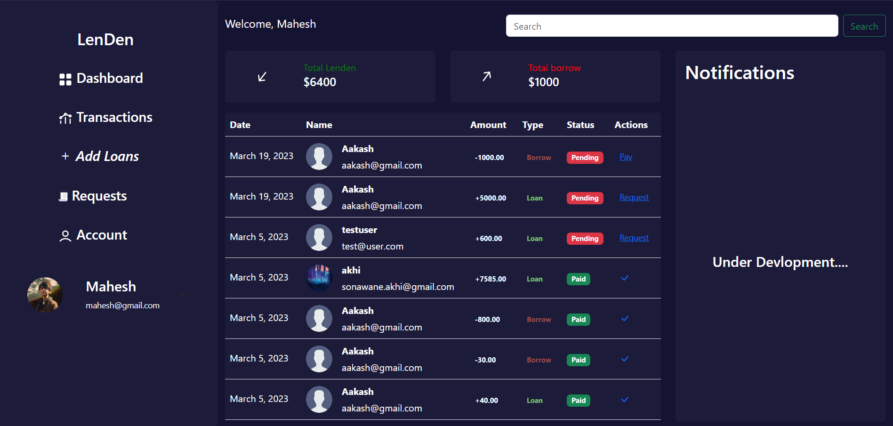
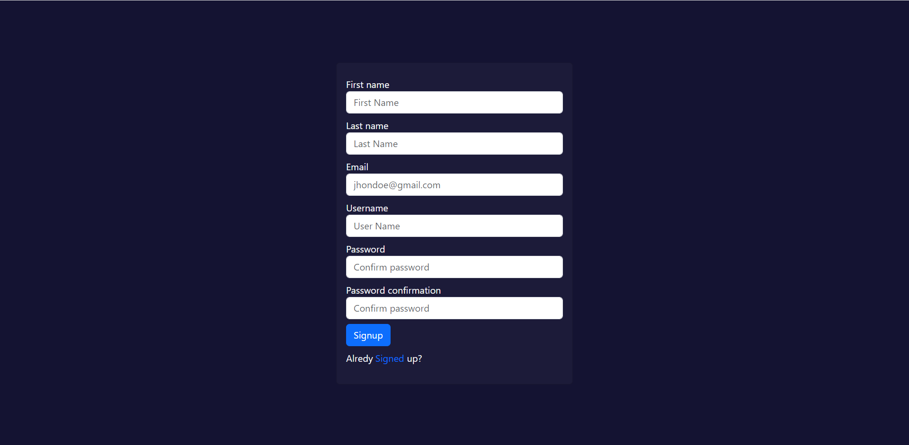
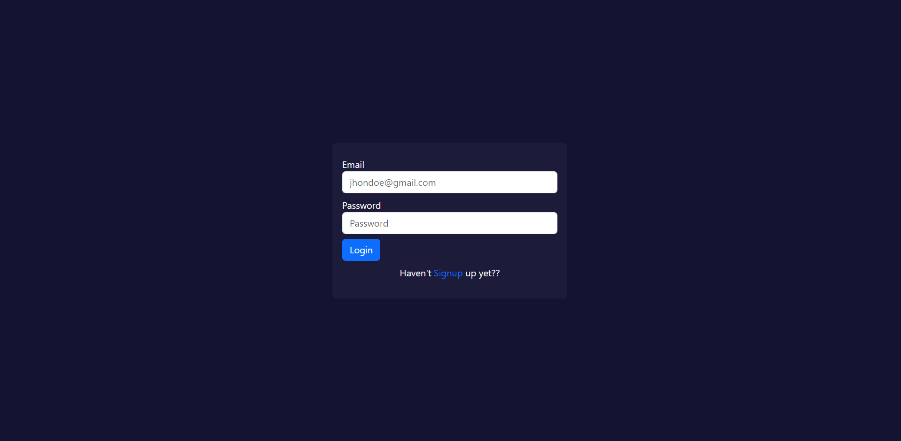
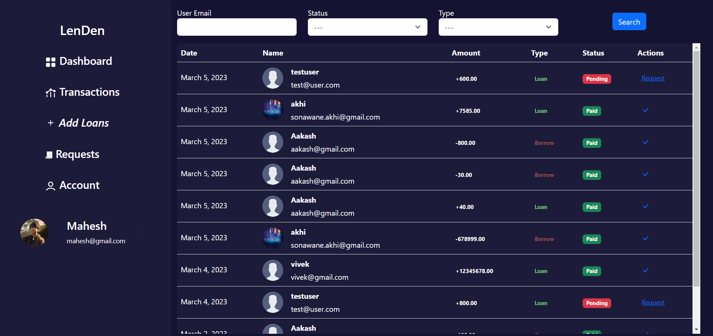
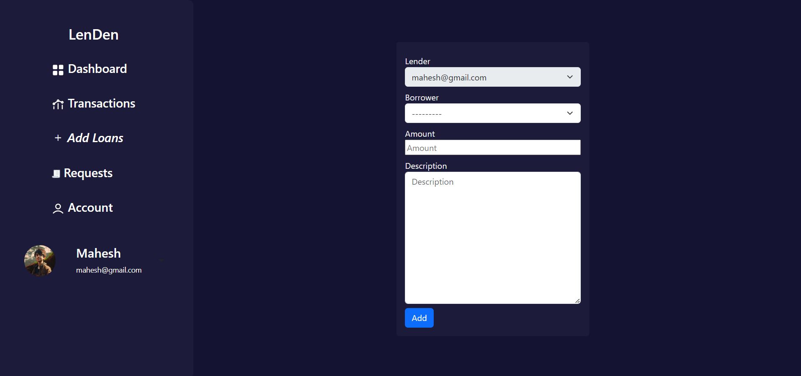
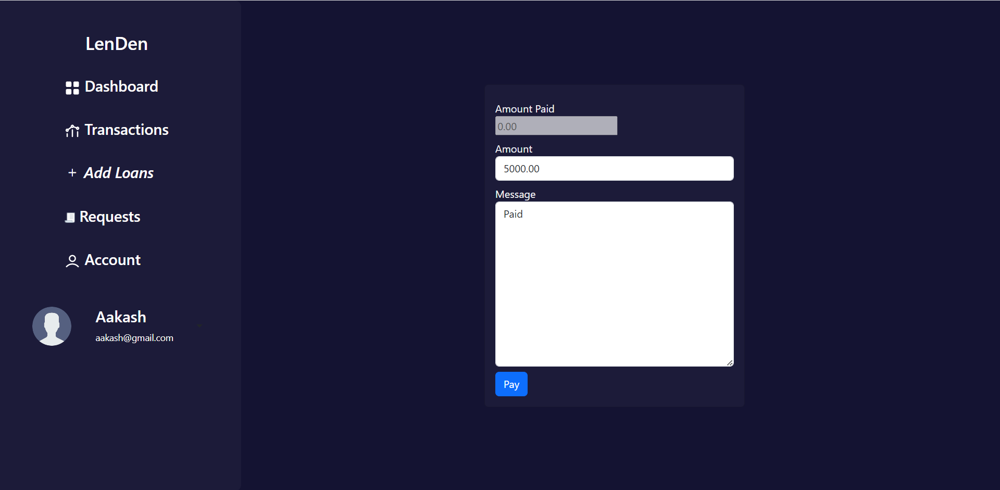
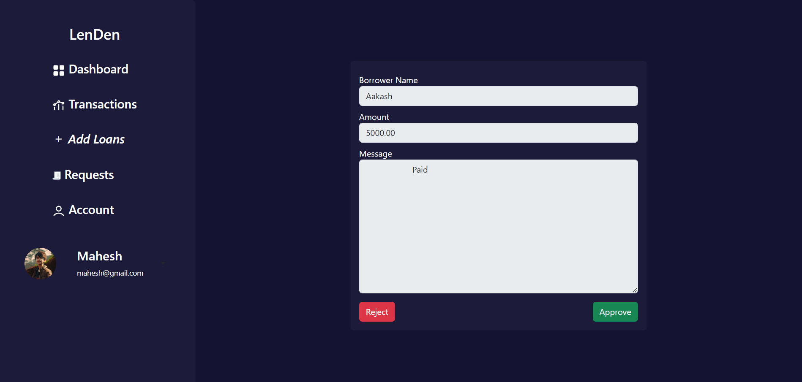

# LenDen



## Table of Contents
* [About](#about)
* [Features](#features)
* [Installation](#installation)
* [Usage](#usage)
* [Todo](#todo)
* [Preview](#preview)
* [Contributing](#contributing)
* [License](#license)

## About
LenDen is a Django app designed to help users manage their finances by keeping track of their lending and borrowing activities. With LenDen, users can easily record all of their transactions, including loans given or received, repayments, and outstanding balances.
 
## Features
* Record loans, repayments, and outstanding balances.
* View an overview of your cash flow.
* Monitor your loans.
* Search and filter transactions by date range, category, or other criteria.

## Installation

### prerequisites

* Python 3.6 or higher
* Django 3.1.2 or higher

### Clone

Clone this repo to your local machine using
```
git clone https://github.com/Mahhheshh/LenDen.git
```

### Setup

* Create a virtual environment
```bash
cd LenDen
pip install pipenv
pipenv shell
```

* Install the requirements
```bash
pip install -r requirements.txt
```

* run the migrations
```bash
python manage.py migrate
```

## Usage
Go to the LenDen folder and run
```
python manage.py runserver
```
Then go to the browser and enter the url [localhost:8000](http://localhost:8000/)

## Todo
- [ ] :bell: Add in-app notifications feature for new transactions
- [ ] :money_with_wings: Allow lenders to request money back from borrowers
- [ ] :bar_chart: Create a dashboard to display a summary of the user's finances
- [ ] :hammer_and_wrench: Improve the HTML structure of the web app

## Preview
Signup


Login


Dashboard


Transactions


Add Loans


Make Payment Request


Manage Payment Requests



## Contributing
Pull requests are welcome. For major changes, please open an issue first to discuss what you would like to change.

## License
LenDen is licensed under the [MIT License](LICENSE).

made with :heart: by [Mahesh](https://github.com/Mahhheshh)